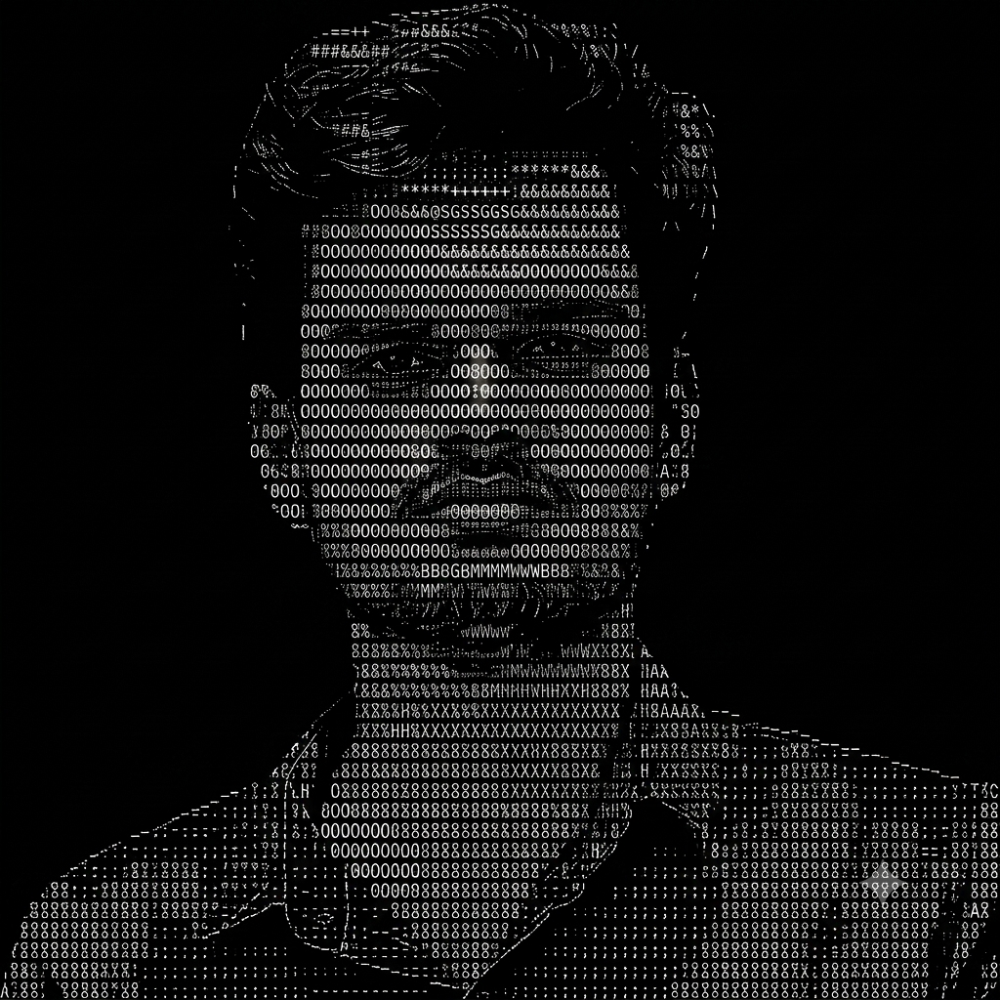

<!-- ================= ACCOUNT NOTICE ================= -->

> ⚠️ **Heads up:** My old account **`ayushcmd`** was suspended by GitHub's abuse detection system without any clarification, and I lost access to some of my repos in the process.
>
> This is my new account: **[`ayushcmdx`](https://github.com/ayushcmdx)** — please follow/connect here going forward.

 

 

<!-- ================= ABOUT ================= -->
### About Me

<!--
  IMAGE PATH NOTE:
  Ayush_Raj_Face.png lives in the /img folder of this repo.
  If you move it to the repo root instead, change the src below to:
  Ayush_Raj_Face.png
-->

<table width="100%">
  <tr>
    <td width="30%" valign="top" align="center">
      
    </td>
    <td width="70%" valign="top">

<pre>
ayushcmd

  Name        : Ayush Raj
  College     : IIT Patna
  Grad Year   : 2028
  Interests   : Full-Stack Dev, AI/ML, Data Analytics

- Connect On ----------------------------------------
  Email       : <a href="mailto:ayush_24a12res897@iitp.ac.in">ayush_24a12res897@iitp.ac.in</a>
  Portfolio   : <a href="https://ayushcmd.me">https://ayushcmd.me</a>
  GitHub      : <a href="https://github.com/ayushcmdx">https://github.com/ayushcmdx</a>
  LinkedIn    : <a href="https://www.linkedin.com/in/ayushcmd">https://www.linkedin.com/in/ayushcmd</a>
</pre>

    
  </tr>
</table>

 

<!-- ================= SKILLS (one-liner) ================= -->
### Skills

**Languages:**
&nbsp;
&nbsp;
&nbsp;
&nbsp;
&nbsp;
&nbsp;
&nbsp;

**Frameworks & Libraries:**
&nbsp;
&nbsp;
&nbsp;
&nbsp;
&nbsp;
&nbsp;
&nbsp;
&nbsp;
&nbsp;

**Databases:**
&nbsp;
&nbsp;
&nbsp;

**Tools & Platforms:**
&nbsp;
&nbsp;
&nbsp;
&nbsp;
&nbsp;
&nbsp;
&nbsp;
&nbsp;
&nbsp;

 

<!-- ================= PROJECTS ================= -->

<h3> Projects &nbsp;</h3>

 

<table width="100%">
  <tr>
    <td width="50%" valign="top">
      <h3 align="center">CommodityChain</h3>
      

        Real-time <strong>commodity intelligence platform</strong> — live prices, AI analysis, India macro layer, Dollar Stress Index, and shock simulator. 13 modules, FastAPI backend with WebSockets.
      

      

        
        
        
        
        
      

      

        
        
      

    </td>
    <td width="50%" valign="top">
      <h3 align="center">Dollar Hegemony Dashboard</h3>
      

        End-to-end <strong>ML research system</strong> quantifying US Dollar dominance on BRICS economies. Novel Dollar Stress Index — XGBoost+SHAP, LSTM & Transformer via Ridge meta-ensemble. Live dashboard + FastAPI backend.
      

      

        
        
        
        
      

      

        
      

    </td>
  </tr>
</table>

 

<!-- ================= STATS (no toggle, normal view) ================= -->
### Stats

 

  

 

  <i>"Experiences over things. Knowledge over noise. Contribution over consumption."</i>

